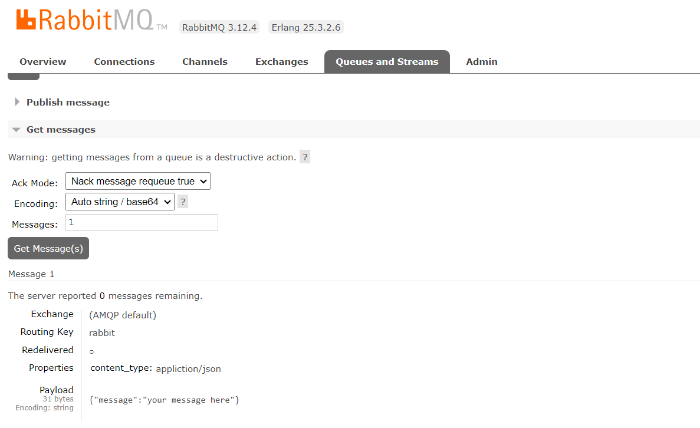

# گزارش پروژه داکر
1-فایل پروژه را دانلود کرد و داخل ریپازیتوری پوش می کنیم

2-حالا برای هر کدام از پروژه ها یک داکرفایل می نویسیم

3-برای کل پروژه که شامل 2 تا فایل بیلد  گولنگ و یک rabbitmqو یک nginx , یک postgress می باشد داکرکامپوز می نویسیم

4-حالا docker-compose config می گیریم 

5-بعد docker compose build میگیریم و با مشکل پیدانکردن go.mod به علت کپی بودن و کاستوم نبودن پارتیشن بندی ها در داکر فایل می خوریم که آن را کاستوم می کنیم

6-حالا docker compose up می کنیم و مشکل برقراری ارتباط با دیتابیس پستگرس و ربیت را می بینیم که با ست کردن نت برای هر کدام از آن ها و دادن به همه ایمیج ها این مشکل ار حل می کنیم

7-حالا دوباره  docker compose up می کنیم و با مشکل Volume های اشتباه به علت هماهنگ نبودن با این پروژه می خوریم که آن را با تغییر پارتیشن بندی فایل ها حل می کنیم

8-حالا دوباره docker compose up می کنیم و با موقفیت همه آن ها درست می شوند

9-حال آن را تست می کنیم

 ``` 
 curl -X POST localhost:9090/send -H 'Content-Type: application/json' -d '{"message":"your message here"}'
 
 ```

 10-حالا وارد rabbitmq در آدرس localhost:15672 و با نام کاربری guest و پسورد guest می شویم و داخل صف آن پیام خود را میبینیم



 11-حالا وارد مرحله پوش به گیت هاب می شویم 